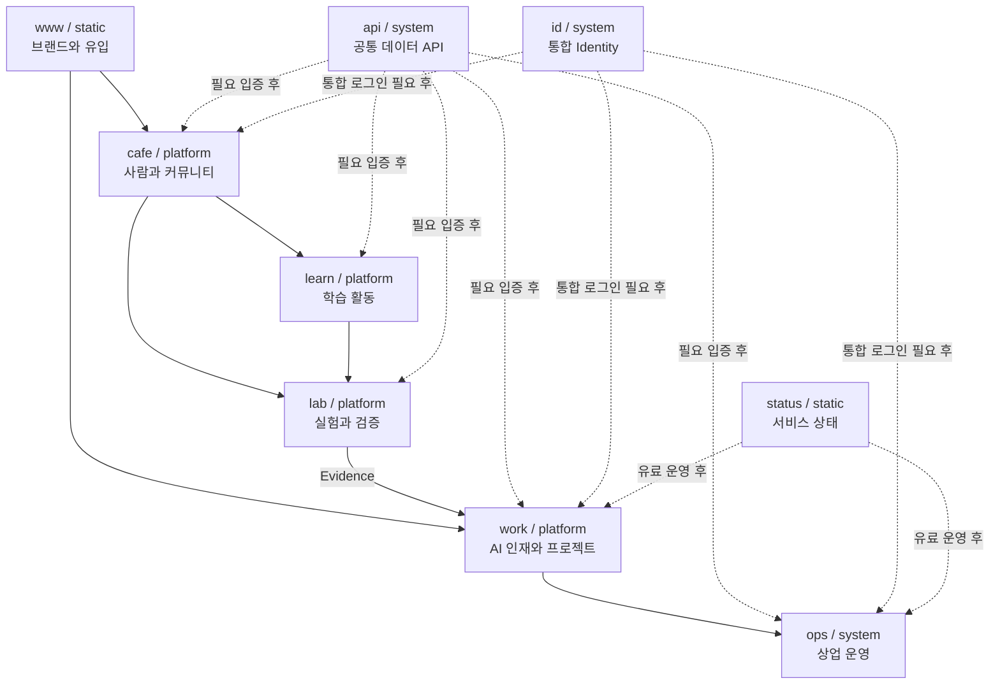

# HBKR Service Map

## 1. 저장소 명명 규칙

```text
net-hbkr-{subdomain}-{type}
```

`type`은 비즈니스 영역이나 기술 스택이 아니라 구현·운영 성격이다.

### static

- 읽기 중심
- 로그인과 사용자별 상태가 없음
- 자체 DB가 없음
- 정적 자산으로 배포 가능
- 외부 접수 링크 또는 단순 외부 폼 연결은 가능

### platform

- 외부 사용자가 참여하고 데이터를 생성
- 둘 이상의 사용자 역할 또는 네트워크 효과가 존재
- Profile, Project, Activity, Evidence 같은 지속 상태가 존재
- 공개 범위와 권한 제어가 필요

### system

- 내부 운영 또는 여러 Platform의 공통 기반
- 업무 상태, 보안, 권한, 감사 가능성이 중요
- 외부 사용자의 시장 참여 공간이 아님

## 2. 서비스 관계



## 3. 서비스 카탈로그

### `www.hbkr.net` / `net-hbkr-www-static`

**한 문장 책임**

HBKR의 AI/AX 실행 네트워크 포지셔닝을 설명하고 기업과 실행자를 적절한 다음 단계로 보낸다.

**주 사용자**

- AI/AX 과제가 있는 기업과 Project Owner
- AI/AX 실행 경험이 있는 전문가와 Builder
- Partner와 Community 잠재 참여자

**성공 신호**

- 방문자가 5초 안에 기업용·실행자용 두 진입점을 구분
- 프로젝트 문의와 실행자 참여로 이동
- HBKR가 교육 사이트가 아니라 AI/AX 실행 네트워크임을 이해

### `work.hbkr.net` / `net-hbkr-work-platform`

**한 문장 책임**

AI 인재와 AI 프로젝트를 같은 기준으로 표현하고 운영자가 만든 Match 판단을 양쪽에 전달한다.

**주 사용자**

- Project Owner
- Talent / Practitioner
- 양쪽 역할을 동시에 가진 Member
- 제한된 범위의 HBKR Operator

**성공 신호**

- 실제 Project Brief 접수
- 실제 Talent Profile 접수
- 운영자가 Shortlist와 Match 근거를 작성 가능
- 프로젝트 상담 또는 계약 단계로 전환

### `ops.hbkr.net` / `net-hbkr-ops-system`

**한 문장 책임**

Lead부터 Discovery, Team Design, Proposal, Contract, Delivery, Settlement, Evidence까지 상업 운영을 통제한다.

**주 사용자**

- HBKR / DreamLabs Operator
- PM, QA, Commercial 담당자

**성공 신호**

- 누락 없는 Lead 추적
- 표준 Discovery Brief 생산
- 후보와 선택 근거 기록
- 계약·Delivery·정산 상태 추적
- 프로젝트 종료 후 Evidence 환류

### `cafe.hbkr.net` / `net-hbkr-cafe-platform`

**한 문장 책임**

AI/AX에 관심 있는 사람들이 관계를 만들고 활동하며 Learn과 Lab으로 이동하는 커뮤니티 장소다.

**주 사용자**

- Member
- Meetup 참여자
- Vertical Community 운영자
- 캠핑하는 프로그래머 참여자

**성공 신호**

- 실제 모임과 활동 참여
- Member와 관심사의 발견
- Cafe 활동에서 Learn·Lab 참여 발생
- HungryBoxer History와 현재 HBKR 연결

`Cafe`는 게시판 제품만을 뜻하지 않는다. 화면에서는 `HBKR CAFE / AI/AX People & Community`처럼 의미를 함께 표시한다.

### `lab.hbkr.net` / `net-hbkr-lab-platform`

**한 문장 책임**

AI/AX 가설, Prototype, Field Test, 실패와 결과를 재현 가능한 Evidence로 기록한다.

**주 사용자**

- Builder
- Mentor
- Domain Specialist
- Field Tester

**성공 신호**

- Problem과 Hypothesis가 명시된 실험
- Result, What Failed, Next가 포함된 기록
- Talent Profile에서 인용 가능한 Evidence 생산
- 상업 후보 발생 시 Lab을 멈추고 Work로 전환

### `learn.hbkr.net` / `net-hbkr-learn-platform`

**한 문장 책임**

사람에게 등급을 붙이지 않으면서 활동별 AI/AX 역량을 형성하고 실제 사용자 행동을 관찰한다.

**주 사용자**

- Foundation 참여자
- Applied 참여자
- Builder와 Mentor

**성공 신호**

- 학습자가 실제 문제를 AI로 다룸
- 검증과 반복 개선 행동이 관찰됨
- Builder가 실제 사용자 behavior를 학습
- Lab으로 이동 가능한 결과 생성

### `api.hbkr.net` / `net-hbkr-api-system`

**한 문장 책임**

여러 서비스가 동일한 핵심 데이터를 사용하게 되었을 때 공통 API와 데이터 계약을 제공한다.

초기에는 만들지 않는다. `work`와 `ops`의 실제 경계가 검증되기 전 공통 API부터 만들면 잘못된 모델을 고정할 가능성이 높다.

### `id.hbkr.net` / `net-hbkr-id-system`

**한 문장 책임**

여러 Platform 간 통합 Identity, 로그인, Role과 Access Policy를 제공한다.

초기에는 만들지 않는다. 최초 인증은 선택된 Platform 내부에서 시작할 수 있으며 두 개 이상의 서비스에 통합 로그인이 필요할 때 분리한다.

### `status.hbkr.net` / `net-hbkr-status-static`

**한 문장 책임**

유료 고객과 사용자가 서비스 가용성, 장애, 복구 상태를 확인하게 한다.

실제 유료 운영과 SLA 성격의 고지가 필요해질 때 만든다.

## 4. 이름을 예약하되 만들지 않는 원칙

서브도메인 이름을 설계에 포함하는 것과 저장소·서비스를 즉시 만드는 것은 다르다.

다음 조건 중 하나가 없으면 빈 저장소를 만들지 않는다.

- 실제 사용자가 진입할 예정
- 운영 데이터가 존재
- 기존 저장소에서 분리할 명확한 독립 배포 책임이 존재
- 다음 30일 안에 구현할 담당자와 완료 기준이 존재

